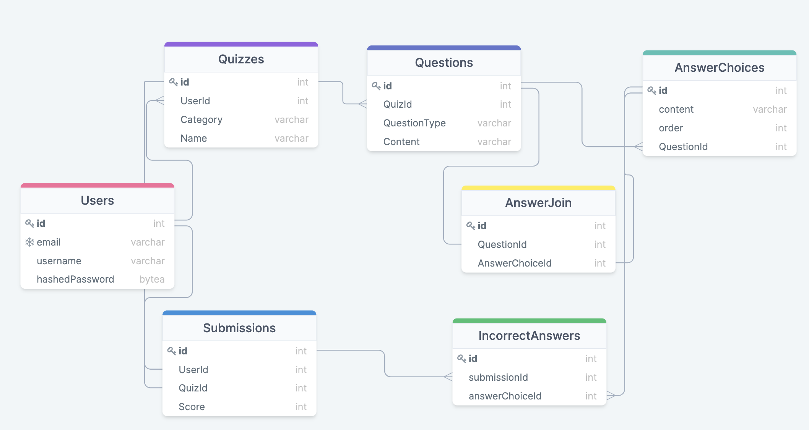

# Welcome to AlgoRhythms!

This is a full-stack web application built using React + Redux (front-end) & SQLAlchemy + Flask + PostgreSQL (back-end)

AlgoRhythms is an interview practice app with customizable coding quizzes and data visualizations.

This project is [currently hosted on Heroku](https://algorhythms-app.herokuapp.com/)!


## MVP Features:

### Feature 1: User Authentication (_Estimated time:_ 2 days - 10/06 - 10/07)
* Users can create an account in order to access the main content of the site.
* Users can login/logout and persist their sessions across different pages and page reloads.
* There is a demo user available in order to provide easy access to exploring full site functionality.

### Feature 2: Quiz Creation (_Estimated time:_ 2 days - 10/08 - 10/09)
* Logged in users can create customized quizzes.
* Quizzes can be composed of a variety of pre-defined question types.
* Quizzes can be edited at any time by the quiz creator.

### Feature 3: Quiz Taking (_Estimated time:_ 1 days - 10/12)
* Users can sort quizzes by time and category.
* Users can take any available quizzes and receive a percentage score.

### Feature 4: Data Visualization (_Estimated time:_ 2 days - 10/13 - 10/14)
* Users can view visualizations of common algorithms.


## Database Schema:





## Redux Sample State:

```
{
     authentication: {
            id: 1,
            email: "demo@user.io",
            username: Demolition
     }
     quizzes: {
            current: {
              correctAnswers: [2, 5, 6],
              correctChoices:["2", "6"],
              incorrectChoices: ["3"],
              score: 66,
              quizId: 1
            }
     }
}
```


# MVP RESTful EndPoints:

## Frontend Routes:

| Method         | Path                     | Purpose              |
|---             |---                       |---                   |
| Get            | /                        |  Home Page           |
| Get            | /users/signup            |  Sign-Up Form        |
| Get            | /users/login             |  User Login Form     |
| Get            | /quizzes/<quizId>        |  View Quiz           |
| Get            | /visualizations          |  View Algo Visualizations |


## Backend Routes:
| Method         | Path                     | Purpose              |
|---             |---                       |---                   |
| Post           | /api/users                   |  Create User Account |
| Post           | /api/users/login             |  Authenticate User   |
| Post           | /api/quizzes                 |  Create New Quiz |
| Put            | /api/quizzes/<quizId>        |  Edit Quiz |
| DELETE         | /api/quizzes/<quizId>        |  Delete Quiz |
| Post           | /api/quizzes/submit          |  Submit a Quiz |
